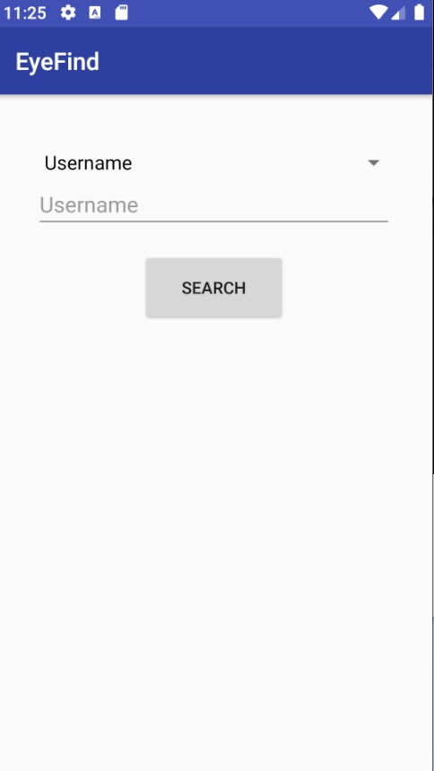
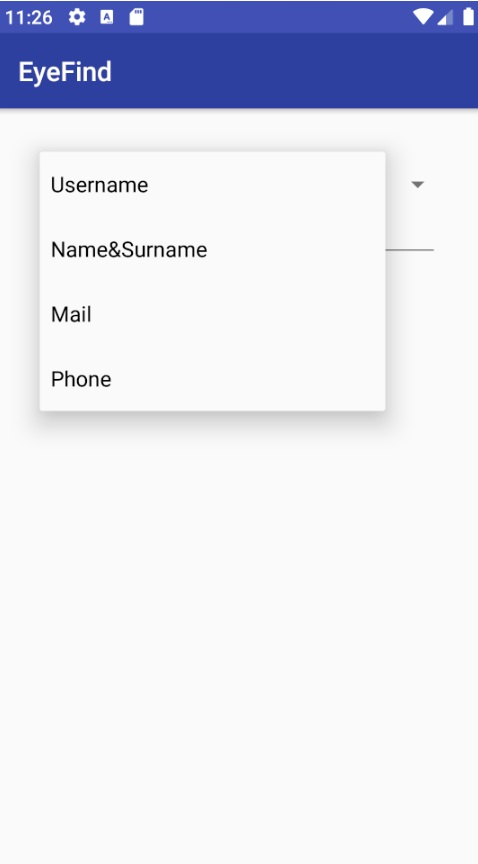
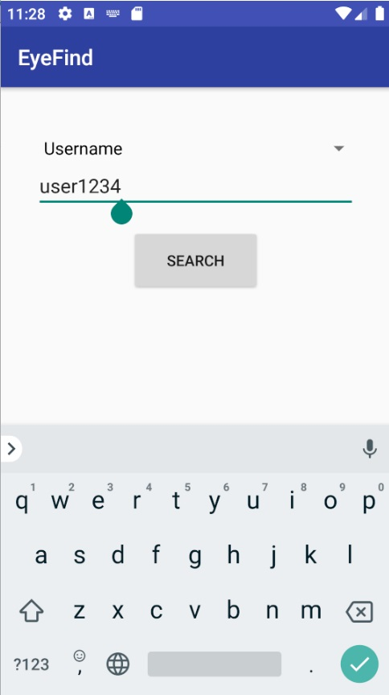
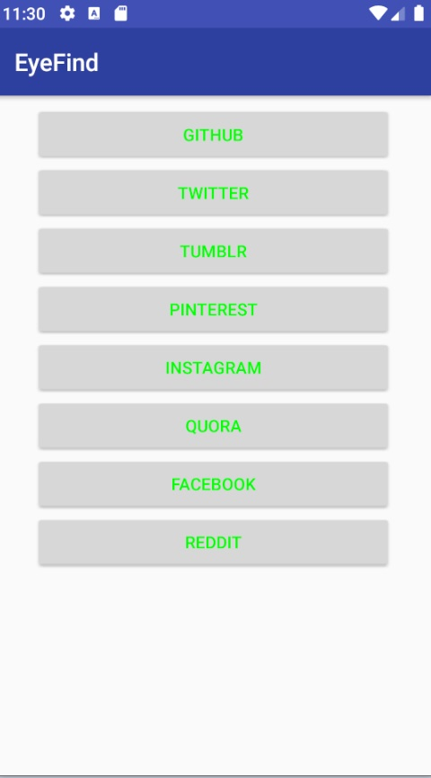

# FindEye Android App
Passive information gathering application on Android

# Installation 
You can install the application with clone this repository by the commands given below
```
# clone the repository
$ git clone https://github.com/selenkutanoglu/AndroidApp
```
Then you can edit it on [Android Studio](https://developer.android.com/studio) or you can install it on your Android phone

# Usage

As you open the application on an Android device, you'll see an homepage like that



You can select your input type



After you entered the input you can click on Search button



According to the input you entered, application will return the site links by the http responses. All **Http OK** responses are shown in the **ResultActivity** with site buttons



You can see te account webpage via cllicking on the buttons


# Note
Application has the only search by username feature for now. Application will be improved in later times.
You can help the application with fork it in your own account and send us pull requests :)
